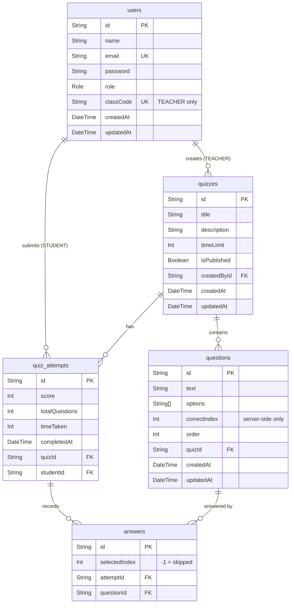
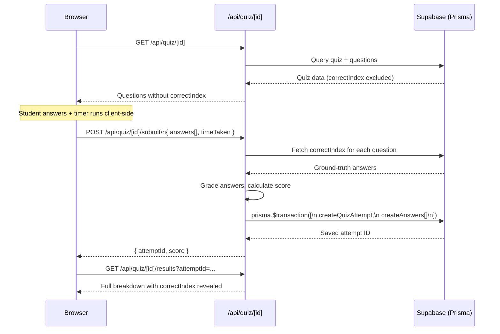

# Architecture — QuizArena

## Overview

QuizArena is a full-stack, multi-role web application built with **Next.js 16 (App Router)**, using React Server Components alongside Client Components. It relies on a **Supabase (PostgreSQL)** backend accessed via **Prisma v7** with the `@prisma/adapter-pg` serverless adapter. Authentication is handled by **NextAuth v5** (Auth.js) with a Credentials provider and role-based access control.

---

## Data Model

Five tables, all related through foreign keys. The unique constraint on `(quizId, studentId)` is the core business rule that enforces one attempt per student.



### Key Constraints
| Constraint | Table | Purpose |
|---|---|---|
| `UNIQUE(email)` | `users` | One account per email |
| `UNIQUE(classCode)` | `users` | Teacher class codes are globally unique |
| `UNIQUE(quizId, studentId)` | `quiz_attempts` | Enforces one attempt per student per quiz |
| `UNIQUE(attemptId, questionId)` | `answers` | One answer record per question per attempt |

---

## Authentication & Authorization

Authentication uses **NextAuth v5** with a Credentials provider. Passwords are hashed with `bcryptjs` (cost factor 10). On successful login, a **JWT session** is minted that carries `id` and `role`.

```mermaid
flowchart TD
    A([Incoming Request]) --> B{middleware.ts\nEdge Runtime}
    B -->|Public route\n/login /register| C([Pass Through])
    B -->|Unauthenticated\non protected route| D([Redirect → /login])
    B -->|Authenticated\nwrong role| E([Redirect → own dashboard])
    B -->|Authenticated\ncorrect role| F([Pass Through])

    F --> G{Route Type}
    G -->|/teacher/**| H[Server Component\ncalls auth()]
    G -->|/student/**| I[Server Component\ncalls auth()]
    G -->|/api/**| J[API Route Handler\ncalls auth()]

    H --> K[(Prisma → Supabase)]
    I --> K
    J --> K
```

**Why two NextAuth configs?**  
`src/lib/auth.config.ts` is an edge-safe subset (no Node.js APIs) used by `middleware.ts`. The full `src/auth.ts` adds the Credentials provider (which uses `bcryptjs` — a Node.js module) and is only imported in server/API contexts.

---

## Quiz-Taking & Anti-Cheat Flow

`correctIndex` is never sent to the browser. Grading is atomic.



---

## API Reference

All routes under `/api`. Auth-required routes validate the JWT session with `auth()` from `src/auth.ts`.

### Authentication

| Method | Path | Auth | Description |
|---|---|---|---|
| `POST` | `/api/auth/[...nextauth]` | — | NextAuth handler (sign-in, sign-out, session) |
| `POST` | `/api/register` | — | Create a new Teacher or Student account |

**Register body:**
```json
{ "name": "string", "email": "string", "password": "string", "role": "TEACHER | STUDENT" }
```

---

### Teacher — Quiz CRUD

| Method | Path | Auth | Description |
|---|---|---|---|
| `GET` | `/api/teacher/quizzes` | TEACHER | List all quizzes owned by the authenticated teacher |
| `POST` | `/api/teacher/quizzes` | TEACHER | Create a new quiz with questions |
| `GET` | `/api/teacher/quizzes/[id]` | TEACHER | Fetch a single quiz (includes questions + correctIndex) |
| `PUT` | `/api/teacher/quizzes/[id]` | TEACHER | Update quiz metadata and replace questions |
| `DELETE` | `/api/teacher/quizzes/[id]` | TEACHER | Delete quiz and cascade-delete questions/attempts |
| `PATCH` | `/api/teacher/quizzes/[id]` | TEACHER | Toggle `isPublished` status |

---

### Student — Quiz Taking

| Method | Path | Auth | Description |
|---|---|---|---|
| `GET` | `/api/student/quizzes` | STUDENT | List all published quizzes the student hasn't attempted |
| `GET` | `/api/quiz/[id]` | STUDENT | Fetch quiz metadata + questions (correctIndex **omitted**) |
| `POST` | `/api/quiz/[id]/submit` | STUDENT | Submit answers; server grades and persists attempt |
| `GET` | `/api/quiz/[id]/results` | STUDENT | Fetch attempt results with correctIndex revealed |
| `GET` | `/api/quiz/[id]/leaderboard` | STUDENT | Ranked leaderboard for a quiz |

---

## Database Connection Strategy

Supabase exposes two connection modes. The choice matters for Prisma:

| | Session Pooler (port 5432) | Transaction Pooler (port 6543) |
|---|---|---|
| **Use** | DDL operations (migrations, `db push`) | Application runtime queries |
| **Env var** | `DIRECT_URL` | `DATABASE_URL` |
| **Config** | `prisma.config.ts` (CLI) | `@prisma/adapter-pg` (runtime) |
| **Why** | `db push` requires long-lived connections; transaction mode breaks DDL | Serverless-safe; each query is a short transaction |

---

## Non-Obvious Decisions & Trade-offs

| Decision | Trade-off |
|---|---|
| **`db push` instead of migrations** | Faster iteration; loses migration history. Acceptable for v1 but should migrate to `prisma migrate dev` before v2. |
| **JWT sessions (not DB sessions)** | No session table to manage; stateless. Downside: can't invalidate a specific session without a blocklist. |
| **Client-side timer** | Simpler implementation; avoids WebSockets. A determined attacker could manipulate it, but the server validates `timeTaken` on submit and the attempt is locked after one submission. |
| **Prisma output to `src/generated/`** | Keeps generated code inside `src/` for TypeScript path resolution; committed to avoid a required `prisma generate` step before every import resolves. |
| **`@google/genai` dependency** | Present in `package.json` — reserved for a planned AI question-generation feature (not yet exposed in the UI). |
